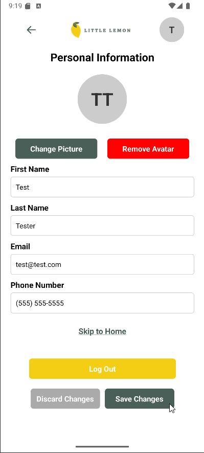

Please download and test it locally.  

> Wireframe is in the wireframe folder.  
> Screenshots are available in the screenshots folder.  
> Unzip and navigate to the folder in Terminal, and run the "npm intall" command.  
> Next, run the Expo command: npx expo start  
> Metro Bundler will start and display a QR code. Open it with Expo Go on Android or the Camera app on iOS. Below the QR code, you'll find more instructions. If you have installed Android Studio, you can press the "a" key on your keyboard to open the app in the emulator.  
> To test, please enter only your Firstname and Email address. Other information can be entered in the profile screen.  

## Wireframe

<strong>Wireframe:</strong>

  

    
  

  
<strong>Little Lemon APP:</strong>

## Screenshots

<strong>Screenshots:</strong>

    
    
    
    
    

Thanks.  